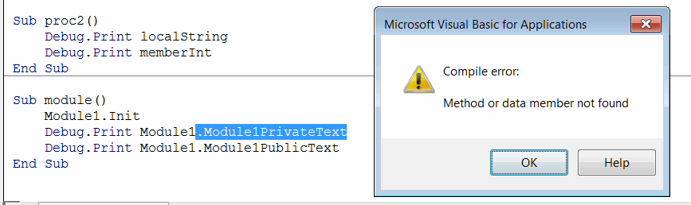
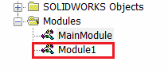
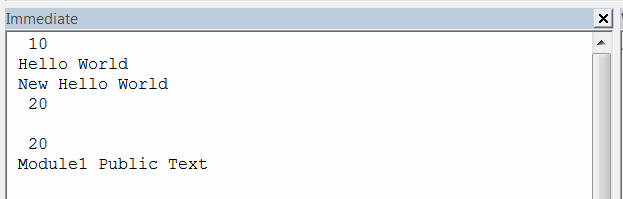
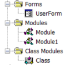

在 Visual Basic 语言中，变量可以在不同的作用域（模块级别、函数内部、代码块内部）中声明，并且具有不同的访问修饰符（私有或公共），这些修饰符定义了它们在代码中的可见性。

## 类或模块（也称为成员）

通常在类的头部声明（在函数和过程之外）。成员变量有两个级别的可见性（私有和公共）。

### 私有

使用 *Dim* 或 *Private* 关键字声明，只能在该类或模块的函数和过程中可见。

*Module1*

```vb
Dim member As Integer
Private member1 As String

Sub Init()
    member = 10 '在 Module 的 Init 函数中可见
    member1 = "A"
End Sub
```

私有变量无法从模块或类的外部访问。当尝试从类或模块的外部访问私有成员时，会出现编译错误：找不到方法或数据成员。

{ width=500 }

### 公共

使用 *Public* 关键字声明的公共变量可以从当前模块或类以及外部模块或类访问。

*Module1*
```vb
Dim publicMember As Integer
```

*Module2*
```vb
Sub main()
    Module1.publicMember = 20 '从外部模块访问并赋值变量
End Sub
```

公共成员也可以使用 *Global* 关键字声明。它的行为与 *Public* 完全相同，但只能在[模块](/docs/codestack/visual-basic/modules/)中声明，不能在[用户窗体](/docs/codestack/visual-basic/user-forms/)或[类模块](/docs/codestack/visual-basic/classes/)中声明。

## 局部

局部变量在特定代码块或函数的作用域中声明，只在该代码块中可见，出现在变量声明之后的代码中。

```vb
Dim var1 As Double
var1 = 0.5 'var1 在这里可见
var2 = 0.25 'var2 在这一步不可见，因为它在下一行声明
Dim var2 As Double
```

### 代码块
在循环或条件语句中定义的变量。

```vb
If res Then
    Dim localVar As Integer '在 If 代码块内定义的局部变量
    localVar = 25
End If
```

尽管局部代码块变量只在该代码块内可见，但不能在其他代码块中使用相同的变量名。

### 函数或过程

在函数或过程的上下文中定义的变量。这些变量在函数或任何嵌套的代码块中可见。

```vb
Sub main()
    Dim localVar As String
    Dim localBoolVar As Boolean
    localVar = "Hello World"
    If localBoolVar Then '在条件语句中访问局部变量
        localVar = "New Hello World" '在条件语句的主体中修改局部变量
    End If
End Sub
```

### 函数或过程参数

在函数的签名中定义的变量。这些变量的声明相当于在函数体的第一行声明的局部函数变量，即这些变量对该函数中的所有代码块都可见。

```vb
Sub DoWork(paramVar As Double, paramVar2 As Integer)
End Sub
```

下面的示例演示了在不同作用域中声明的变量的行为：

*Module1*


```vb
Public Module1PublicText As String '公共变量在模块外可见
Dim Module1PrivateText As String '只能由该模块的函数和属性访问

Sub Init()
    
    Module1PublicText = "Module1 Public Text"
    Module1PrivateText = "Module1 Private Text"
    
End Sub
```


*Main Module*

```vb
Dim memberInt As Integer

Sub main()
    
    memberInt = 10
    
    Dim localString As String
    localString = "Hello World"

    Debug.Print memberInt '输出 10
    Debug.Print localString '输出 Hello World
    
    proc
    proc2
    module
    
End Sub

Sub proc()
    
    Dim localString As String
    localString = "New Hello World"
    
    memberInt = 20
    
    Debug.Print localString '输出 New Hello World
    Debug.Print memberInt '输出 20
    
End Sub

Sub proc2()
    Debug.Print localString '输出空字符串，因为 main 和 proc 函数中的 localString 局部变量在此作用域中不可见
    Debug.Print memberInt '输出 20，因为模块级变量在 proc 函数中被修改
End Sub

Sub module()
    Module1.Init
    'Debug.Print Module1.Module1PrivateText '编译错误，因为变量在模块 1 外不可见
    Debug.Print Module1.Module1PublicText '输出 Module1 Public Text
End Sub
```


输出到[即时窗口](/docs/codestack/visual-basic/vba/vba-editor/windows#immediate-window)

{ width=350 }

## 作用域表

给定以下项目结构：



每个文件都有以下声明：

### UserForm

```vb
Public VarFormPublic As String
Private VarFormPrivate As String
Dim VarFormDim As String
Dim VarFormGlobal As String '不能声明
```

### Module

```vb
Public VarModulePublic As String
Global VarModuleGlobal As String
Dim VarModuleDim As String
Private VarModulePrivate As String
```

### Class

```vb
Public VarClassPublic As String
Dim VarClassDim As String
Private VarClassPrivate As String
Dim VarClassGlobal As String '不能声明
```

下表描述了不同文件中变量的可见性

|变量名|UserForm|Module|Module1|Class
|---|---|--|--|--|
VarFormPublic|✓|✓|✓|✓|
VarFormPrivate|✓|☓|☓|☓|
VarFormDim|✓|☓|☓|☓|
VarFormGlobal|-|-|-|-|
VarModulePublic|✓|✓|✓|✓|
VarModuleGlobal|✓|✓|✓|✓|
VarModuleDim|☓|✓|☓|☓|
VarModulePrivate|☓|✓|☓|☓|
VarClassPublic|✓|✓|✓|✓|
VarClassPrivate|☓|☓|☓|✓|
VarClassDim|☓|☓|☓|✓|
VarClassGlobal|-|-|-|-|