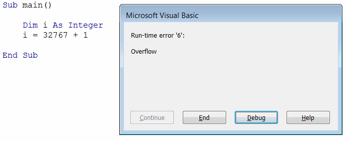

 Visual Basic 中标准类型（例如 Integer、String、Double、Object 等）的概述
image: vba-integer-overflow.png
sidebar_position: 0
---
以下分类列出了按类别分组的 Visual Basic 中的不同标准类型。每种类型分配不同大小的内存存储空间。某些类型具有声明字符，可用于以简短形式显式定义变量的类型。大多数类型提供将值从变体转换的特定函数。

## 数值

数值类型变量用于保存正负整数值（没有小数点），例如 1、2、10、-10、-1000 等。不同的数值类型允许存储不同的值范围，并且需要不同大小的分配存储空间。最常用的类型是 [Integer](#integer)。

如果分配的值不适合范围，则在编译时将显示运行时错误“6”溢出。

{ width=350 }

### Byte
分配 1 字节的存储空间。值范围从 0 到 255。将其转换为 Byte 的函数是 *CByte*。

### Integer
分配 2 字节的存储空间。值范围从 -32,768 到 32,767。整数的类型声明字符是 %。将其转换为 Integer 的函数是 *CInt*。

### Long 
分配 4 字节的存储空间。值范围从 -2,147,483,648 到 2,147,486,647。长整数的类型声明字符是 &。将其转换为 Long 的函数是 *CLng*。

### LongLong
分配 8 字节的存储空间。值范围从 -9,223,372,036,854,775,808 到 9,223,372,036,854,775,807。LongLong 的类型声明字符是 ^。LongLong 只是在 64 位平台上有效的声明类型。

### LongPtr
在 32 位系统上表示 Long 类型（4 字节），在 64 位系统上表示 LongLong 类型（8 字节）。

LongPtr 通常用于编写可在 32 位和 64 位环境中运行的可移植代码。特别是在 [Windows 32 位 API](/docs/codestack/visual-basic/windows-api) 中用于指针和句柄。

## 带小数点的数值
这些类型的变量用于保存带小数点的正负数值，例如 20.5、-152.89 等。不同类型的变量允许存储不同范围的值，具有不同的精度。最常用的类型是 Double。对于高精度数字，可以使用 Currency 或 Decimal 类型。

### Single
分配 4 字节的存储空间。值范围从 -3.402823E38 到 -1.401298E–45 或从 1.401298E–45 到 3.402823E38。单精度的类型声明字符是 !。将其转换为 Single 的函数是 *CSng*。

### Double
分配 8 字节的存储空间。值范围从 -1.79769313486232E308 到 -4.94065645841247E–324 或从 1.79769313486232E308 到 4.94065645841247E–324。双精度的类型声明字符是 #。将其转换为 Double 的函数是 *CDbl*。

### Currency
分配 8 字节的存储空间。值范围从 -922,337,203,477.5808 到 922,337,203,685,477.5807。货币的类型声明字符是 @。将其转换为 Currency 的函数是 *CCur*。

### Decimal
分配 14 字节的存储空间。值范围从 -79,228,162,514,264,337,593,543,950,335 到 79,228,162,514,264,337,593,543,950,335 或从 -7.2998162514264337593543950335 到 7.9228162514264337593543950335。将其转换为 Decimal 的函数是 *CDec*。请注意，Decimal 类型的变量必须声明为 [Variant](/docs/codestack/visual-basic/variables/standard-types#variant)，并使用 *CDec* 函数进行赋值。

## 逻辑
逻辑变量用于 [条件](/docs/codestack/visual-basic/conditions) 并表示为 1（True）或 0（False）。

### Boolean
分配 2 字节的存储空间。可以是 True 或 False。将其转换为 Boolean 的函数是 *CBool*。

## 文本
文本变量保存文字，当定义时，用双引号 "" 括起来。

### String
分配 10 个字节加上字符数的存储空间。值范围从 0 到 20 亿个字符。将其转换为 String 的函数是 *CStr*。

## 日期和时间
保存日期和时间信息的变量。

### Date
分配 8 字节的存储空间。值范围从 100 年 1 月 1 日到 9999 年 12 月 31 日。将其转换为 String 的函数是 *CDate*。

## 引用
这些变量是可能保存复杂数据和结构的任何引用类型。

### Object
分配 4 字节的存储空间。用于 [后期绑定](/docs/codestack/visual-basic/variables/declaration#early-binding-and-late- binding)

## 任意
这些变量类型可以保存任何数据对象（值类型、引用类型或数组）

### Variant
分配 16 字节的存储空间。将其转换为 Variant 的函数是 *CVar*。

下面的代码示例演示了各种标准数据类型的声明和转换。

~~~ vb
Sub main()
    
    Dim byteVar As Byte
    byteVar = 17
    byteVar = CByte("12") '将文本值转换为 byte
    byteVar = CByte(15.6) '浮点数不可接受，因此值将四舍五入为 16
    
    Dim intVar As Integer
    intVar = 12567
    intVar = CInt("124")
    
    Dim longVar As Long
    longVar = 1256936
    longVar = CLng("-124")
    longVar = 123&
    
    Dim longLongVar As LongLong '仅适用于 64 位
    longLongVar = 103456
    longLongVar = 7392984646^
    
    Dim longPtrVar As LongPtr
    longPtrVar = 94874882
    
    Dim singleVar As Single
    singleVar = 3.4E+38 '3.4 * 10^38
    singleVar = CSng("15.656")
    singleVar = 12345.35!
    
    Dim doubleVar As Double
    doubleVar = 3.4E+100
    doubleVar = CDbl("106.278856") '将整数值强制转换为 double
    doubleVar = 12345# 
    
    Dim currVal As Currency
    currVal = 3105.6
    currVal = CCur("31,256,78")
    currVal = 689.3458@
    
    Dim decVal As Variant
    decVal = CDec(1E-18)
    
    Dim boolVar As Boolean
    boolVar = True
    boolVar = CBool(1) '转换为 true
    
    Dim strVar As String
    strVar = "Hello World"
    strVar = CStr(125) '将数字转换为字符串
    
    Dim dateVar As Date
    dateVar = Now() '分配当前日期
    dateVar = CDate("10-Jun-2018")
    
    Dim objVar As Object
    Set objVar = Nothing
    
    Dim varVar As Variant
    varVar = Array("A", "B", "C")
    varVar = "Hello World"
    varVar = CVar(10.5)
    
End Sub

~~~