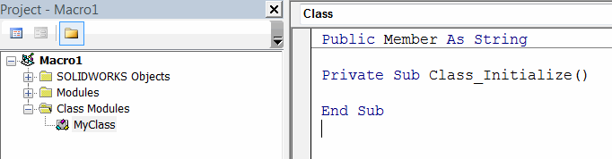

 Visual Basic中用户定义的类型（即对象、类型、枚举）的概述
image: class-module-class-declaration.png
sidebar_position: 0
---

## 枚举
枚举是Visual Basic的数据类型，用于保存一组整数常量。枚举对于定义开发人员（即选项）使用的常量系列非常有用。

有关枚举器的更多信息，请参阅[枚举](/docs/codestack/visual-basic/data-structures/enumerators)文章。

枚举器被视为其他任何数据类型，可以声明和赋值。枚举可以隐式和显式赋值。

~~~ vb
Dim myEnumVal As MyEnum_e
Dim myEnumVal1 As MyEnum_e
myEnumVal = MyEnum_e.Val1 '显式赋值枚举器，指定枚举器的名称
myEnumVal1 = Val1 '隐式赋值枚举器
~~~

## 类型

Visual Basic允许创建新的数据组。自定义用户定义的类型是一种数据类型，也称为*结构*，它允许定义复杂的数据存储。当需要传递或存储由多个元素组成的数据时（例如几何点、日志条目等），类型非常有用。

有关自定义类型的更多信息，请参阅[自定义用户定义的类型](/docs/codestack/visual-basic/data-structures/types)文章。

## 类
与枚举和类型不同，类只能在单独的Visual Basic类模块中创建。

{ width=500 }

类是引用类型，必须使用*new*关键字进行初始化，并且必须使用*Set*关键字分配引用。

有关类的更多信息，请参阅[类](/docs/codestack/visual-basic/classes)文章。

下面的代码示例显示了如何声明和赋值枚举器、类型和类。

*类声明*
~~~ vb
Public Member As String

Private Sub Class_Initialize()

End Sub
~~~

*模块*
~~~ vb
Enum MyEnum_e
    Val1 = 0
    Val2 = 1
    Val3 = 3
End Enum

Type MyStruct
    Field1 As String
    Field2 As Boolean
End Type    

Sub main()

    Dim enumVar As MyEnum_e
    enumVar = Val2
    
    Dim typeVar As MyStruct
    typeVar.Field1 = "Hello World"
    
    Dim classVar As MyClass
    Set classVar = New MyClass
    classVar.Member = "Hello World"

End Sub
~~~