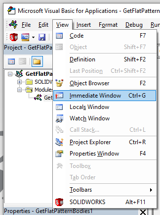
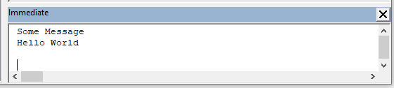

## Immediate Window

The Immediate Window is a console that collects output messages printed from the code.

The Immediate Window is typically used for debugging and troubleshooting as a simple way to output logs or the current state of variables.

To enable this window, click the "View -> Immediate Window" command or use the "Ctrl+G" shortcut.



The window can be docked on any panel of the VBA editor.

To output messages to this window, use the *Debug.Print* command.

```vb
Dim str As String
str = "Hello World"
Debug.Print "Some Message"
Debug.Print str
```



## Watch Window